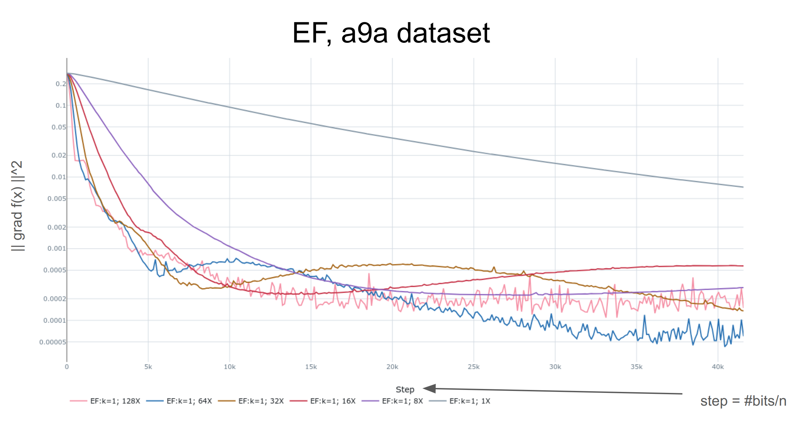
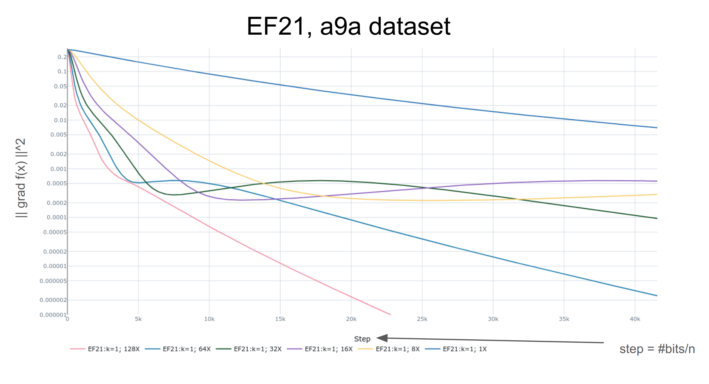
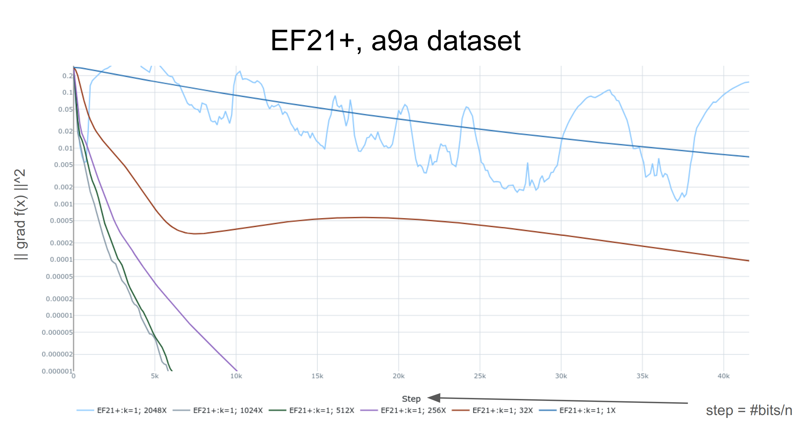
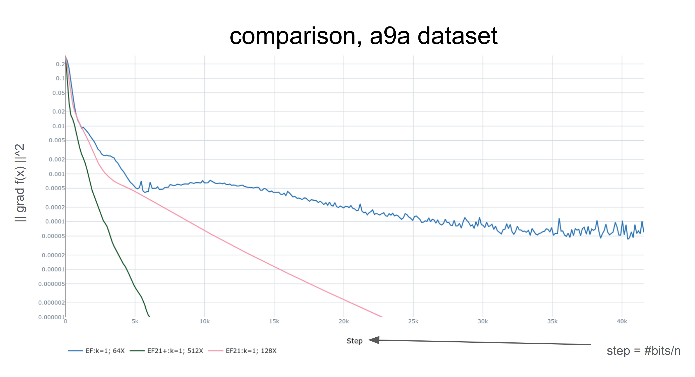

### EF21 experiments implemented in Pytorch

Reproduction of the results of the "EF21: A New, Simpler, Theoretically Better, and Practically Faster Error Feedback" paper.

Results

### Reimplemented section 5.2: stepsize tolerance

##### Compare best of each method

